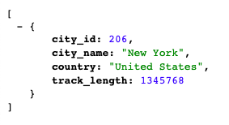

# Deploying an ETL Project Using Postgres on Heroku
This project is a demonstration of using Extract-Transform-Load to: 
1. Extract data from raw CSVs to Python Pandas
2. Transform them into the properly formatted dataframes
3. Load them into a SQL relational database using SQLAlchemy

(Original [ETL-project](https://github.com/ellemonke/ETL-project) by Ellen Hsu and Gary Schulke.)

4. Finally, I created a Flask app that serves JSON data from an API call and pushed the database to Heroku. 

### Data Source:
[Transit Systems of the World](https://www.kaggle.com/citylines/city-lines/data#)

### Live site:
[Transit System Track Length](http://transit-systems.herokuapp.com/)

Example Routes: 
http://transit-systems.herokuapp.com/transit_systems 
http://transit-systems.herokuapp.com/city/London 
http://transit-systems.herokuapp.com/city/New York 
http://transit-systems.herokuapp.com/city/Stockholm 

### Tech Stack: 
**Back-end**: Python (Pandas, NumPy), Flask, SQLAlchemy, SQL (PostgreSQL) 
**Front-end**: Flask, HTML, CSS, Bootstrap

### Detailed Procedure:
1. **Extract:** The original data set contained seven CSVs. We chose three that contained the column 'city_id': cities, stations, and track (length) and imported them into Pandas dataframes.

2. **Transform:** In Pandas, we copied only the relevant columns, renamed them, and dropped the null data. Then the track lengths were grouped and summed by city and converted from meters to miles.

3. **Load:** Using SQL (in PostgreSQL), we created empty tables corresponding to the new dataframes ([table_create_queries.sql](table_create_queries.sql)). 
    - In the first method, we used SQLAlchemy to load the data into each table and then joined them on 'city_id'. The result was a dataframe in Pandas.
    - In the second method, we joined them using a SQL query ([queries.sql](queries.sql)) in PostgreSQL. 
    - In the final step, we used the SQLAlchemy method in a Flask app that returned JSON results. One could also query for a city by simply typing it in the URL. A 404 error was returned if the city was not in the data set.

4. **Publish:**
    1. Created the local db with data in PostgreSQL (see also [ELT-project](https://github.com/ellemonke/ETL-project)).
    2. Created a Heroku app with a Postgres add-on.
    3. Pushed my local db (with data) to the remote Heroku db. 
    `heroku pg:push mylocaldb DATABASE_URL --app transit-systems`
    4. Defined Python functions to query the remote db using SQLAlchemy reflection (app.py).
    5. Create a front-end website with Flask and Bootstrap (app.py).